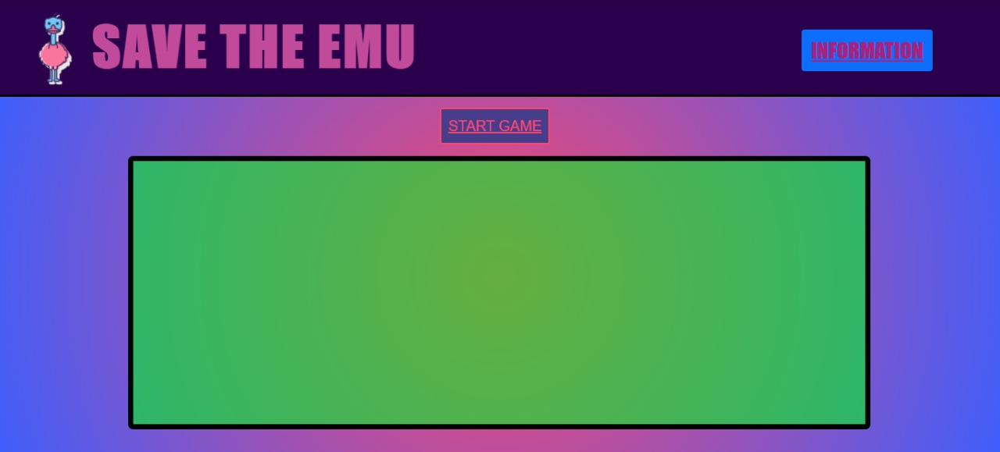

# *Save the Emu*

(Project Module 1 Ironhack)

 

 Click [HERE](https://deat1995.github.io/project-one-ironhack/) to play *Save the Emu*

### Introduction

* Project module 1, Web Development course Ironhack wdpt may 2021.

* The game is inspired by the news about President Bolsonaro and his scene in the middle of a coronavirus pandemic displaying a box of the drug chloroquine for an emu.
Emu is the last of its kind living in the LIZARB country. With the spread of a virus starting a pandemic in his homeland, networks were stunned by untrue news. One of this information that was disseminated by the crazy president of his country directed that the proper treatment to end the health crisis would be to feed the emus with the drug chloroquine, causing all of their kind to die intoxicated. Help Emu not have the same end as his companions by escaping from chloroquines and capturing the real solution to end the virus that is vaccines.

## 🚀 How to play

* Click the start game button and the game will start.
* Use the arrow keys ( ⇧ up arrow/down arrow ⇩ ) on your keyboard.
* Capture the vaccines to earn points and dodge the chloroquines so you don't lose the game.

### 📋 Requirements to play

* Internet
* Pc

## 📦 Development

* HTML
* CSS
* CANVAS
* JAVASCRIPT 

### To come

* GitHub pages hosted so you can play anywhere! (as long as internet is available).
* If you like the game, let me know, maybe I'll try to improve something.

### 🎁 Expressions of gratitude

* I would like to thank the *Ironhack* school for the experience and learning that is provided to us.
The teachers *Daniel K Albanez (DK), **Gabriel Sicuto* and *Júlia Foresti*, for the way that the content is presented in the classroom and the support of doubts inside and outside the classroom.
Thank you very much for this first module 🤓.

Developer: ⌨️ with ❤️ by Debora Tavares 😊